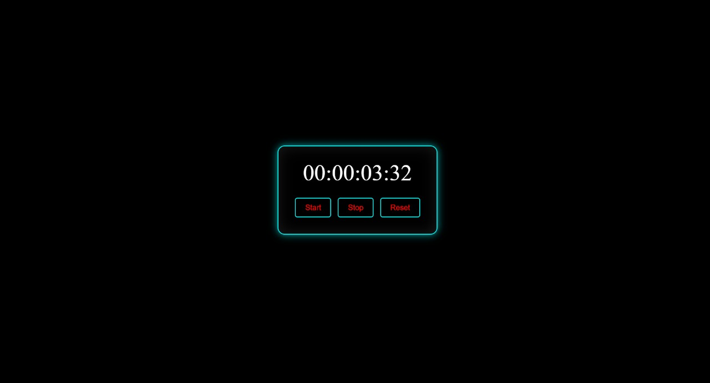
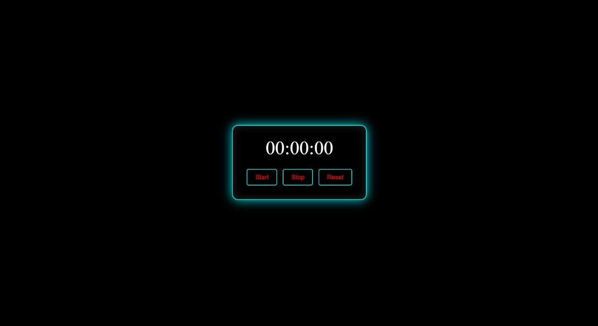

# Infogerm Internship Tasks - Stopwatch Project

## Project Overview

This repository contains my basic internship task from Infogerm, which is a functional **Stopwatch** built using **HTML**, **CSS**, and **JavaScript**.

The stopwatch is designed to be simple, user-friendly, and visually appealing with smooth animations for button interactions and timer display updates.

---

## Technologies Used

- **HTML**: Provides the structure of the stopwatch including buttons and display area.
- **CSS**: Styles the stopwatch for a clean look and adds smooth animation effects on button clicks and timer updates.
- **JavaScript**: Implements the core logic of the stopwatch including start, stop, reset, and lap time functionalities.

---

## Features

### 1. Start

- Begins the timer count from zero or resumes counting from the paused time.
- The timer updates every 10 milliseconds for precise time tracking.
- The start button disables itself while running to prevent multiple clicks.

### 2. Stop

- Pauses the timer at the current time.
- Allows the user to stop the timer anytime.
- Enables the start button again to resume.

### 3. Reset

- Stops the timer and resets the displayed time back to `00:00:00.00` (hours:minutes:seconds.centiseconds).
- Clears all lap times if any were recorded.
- Ready for a fresh start.

### 4. Lap (Optional, if implemented)

- Records the current timer value as a lap time.
- Displays a list of lap times below the stopwatch.

---

## Animation and UI Effects

- Buttons have smooth color transition effects on hover and click to enhance user experience.
- The timer display updates with subtle fade-in/out or scale animations (if implemented) for visual feedback.
- Layout is responsive and clean, designed for ease of use.

---

## How to Run

1. Clone or download this repository.
2. Open `index.html` in any modern web browser.
3. Use the **Start**, **Stop**, and **Reset** buttons to control the stopwatch.
4. (If Lap feature exists) Click **Lap** to record lap times.

---

## Screenshot

---

_Thank you for visiting!_
